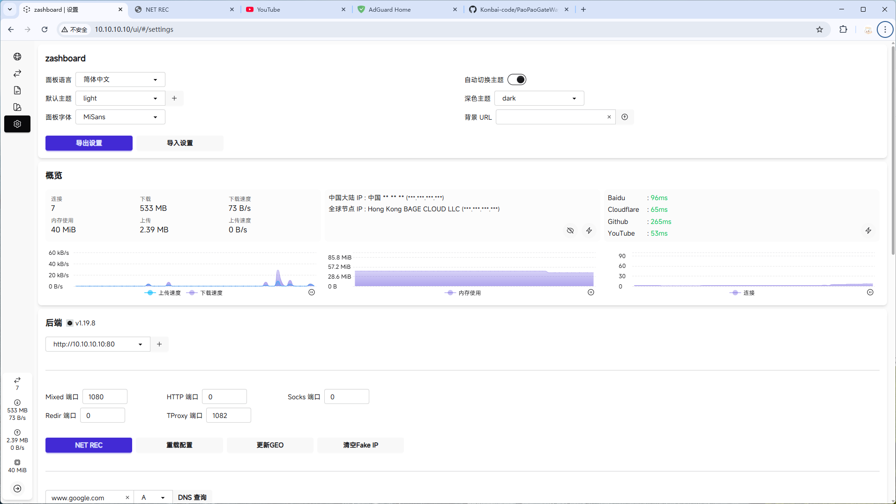

## PaoPao GateWay

本项目为 PaoPao GateWay 的 UI 替代版，保留其 Clash 核心与配置下发能力，仅替换原有管理面板为自定义前端。

继承 PaoPao 全部核心功能- 面板集成NET-REC、配置重载

UI 使用 [Zashboard](https://github.com/Zephyruso/zashboard)，兼容 Clash API。

不影响系统服务与配置生成流程

适用于追求简洁 UI 的用户，或想以此为基础进行二次开发者。